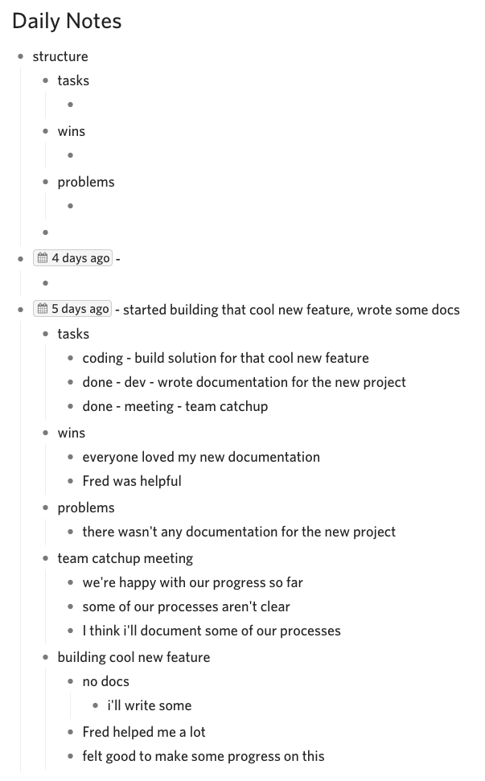
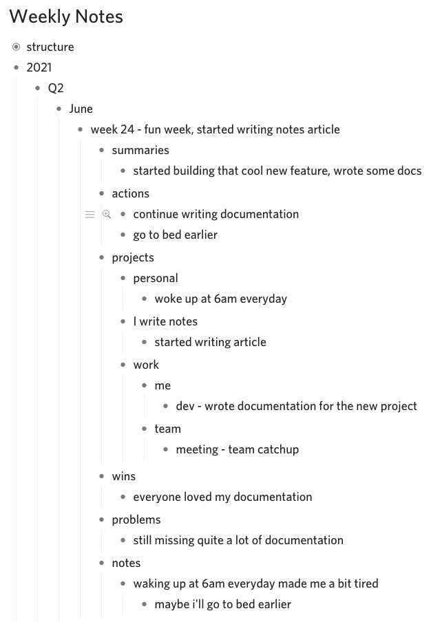
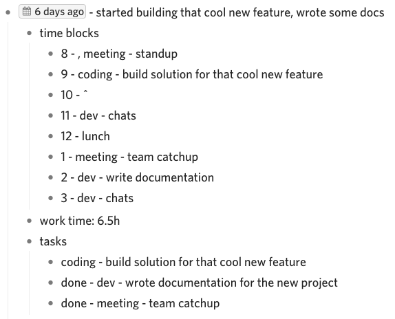

I write lots of notes and I've been writing them for a long time. How I write them changes quite regularly but I've found some strategies over the last few years that I rather like so I thought I would share them.

## Tools

I use [Dynalist](https://dynalist.io/) because:

- It's free. You can also pay to get features like uploading images.
- It's in the cloud. My notes are backed up and available on my phone.
- It's focussed on bullet points instead of documents and rich text. I love bullet points.

It's pretty similar to [Workflowy](https://workflowy.com/) if you've heard of it before.

I handwrote notes at school and uni and kept it up professionally from 2015-2018. I used [Spirax A4 120 page notebooks](https://www.officeworks.com.au/shop/officeworks/p/spirax-a4-no-810-recycled-notebook-120-page-es56800) and [blue BIC finepoint pens](https://www.officeworks.com.au/shop/officeworks/p/bic-cristal-fine-point-ballpoint-pens-blue-12-pack-bi1411be). Non-perforated because perforated pages fall out and 120 because it's big enough without being too big. I would have gone through about 4 notebooks per year until my salad dressing container leaked in my bag and destroyed my notebook so I cracked the shits and went digital.

I found the switch pretty hard at first mainly because I couldn't draw diagrams anymore. I eventually found tools like [Mermaid](https://mermaid-js.github.io/) and their [Live Editor](https://mermaid-js.github.io/mermaid-live-editor/) which let me draw a diagram, copy the link to it and paste it safely in my notes. They were also neater and I could share them with my team so that was nice too. I also found it harder to remember typed notes but that eventually got better and didn't matter as much because I could search through them.

## Daily Notes

I have a document in Dynalist called Daily Notes where each day has a structure like this:

- tasks
- wins
- problems
- (general notes)

For example:

I do this each day:

1. Create a new bullet point underneath structure. Minimise the structure bullet point before hitting enter.
2. Enter the current date with the Dynalist date insert (!), followed by a hyphen.
3. Copy and paste the structure into the current date.
4. Write down my tasks for the day, including meetings.
5. Start my day.
6. Write notes, add any tasks that popup and mark them as done when they're completed.
7. Add a short summary for the day next to the date, after the hyphen.

I like to roughly categorise my tasks. I'm a developer so my categories are:

- dev - General dev tasks including chats, emails, reviewing pull requests, designing solutions, writing documentation etc.
- coding - Actually developing code.
- meeting - Sync time with people.

I generally write down anything noteworthy and that usually turns out to be quite a lot. I wrote 13,783 bullet points and 80,984 words in my Daily Notes for 2020 and I'm up to 7,910 bullet points and 50,504 words so far this year. If in doubt, write it down. I'm always overwriting and underwriting so just experiment and find a level that works for you. I've also found myself being a bit too critical and trigger happy with wins and problems so I now prefer to put more in my general notes and leave the wins and problems for big stuff. That might be more of a me problem though.

## Weekly, Monthly and Quarterly Notes

I ended up writing so many Daily Notes that it was hard to find anything so I started writing notes for larger periods of time to highlight bigger ideas.

I have a Weekly Notes, Monthly Notes and Quarterly Notes document with the following structure:

- summaries
- actions
- projects
  - personal
  - (other projects)
  - work
    - me
    - team
- wins
- problems
- notes

For example:

I write my Weekly Notes on a Monday morning and have it scheduled in my calendar for 45 mins and have something similar for the Monthly and Quarterly notes. I try and fill it out from memory first then go through my Daily Notes to fill in the blanks afterwards. Again, I try to put more in my general notes then move them around afterward. I also try to avoid chats and emails until I do my Weekly notes so I don't get distracted.

The structure is pretty similar to Daily Notes with a few additions:

- Summaries - all the daily summaries for the week in one place.
- Actions - action points for the next week.
- Projects - tasks organised by project.

Writing notes at regular intervals helps professionally for performance reviews but I also like to reflect at a personal level as well. You might reflect on achievements or discover some recurring themes or problems and experiment with some actions for them. I've also fallen into the trap of being a little bit too ambitious with my actions and too critical with my results but you can work that out for yourself. Productivity is overrated anyway.

## Projects

Sometimes a task lasts more than a few days and that's when it becomes a project. I like to keep things simple and write notes in my Daily Notes then move them out into their own document when I need to, usually on the 3rd day of working on it. I organise my project documents by month using Dynalist's folders.

## Time blocks

I've got a section in my Daily Notes called Time Blocks to get a rough idea of where I'm spending my time.

It looks like this:

- time blocks
  - 8 - , meeting - standup
  - 9 -
  - 10 -
  - 11 -
  - 12 -
  - 1 -
  - 2 -
  - 3 -
- work time:

When it's filled out it might look something like this:

Basically, I record what I did in 30 minute blocks. If I did two things in an hour then I separate them with a comma and if I did the same task in the next hour then I use a tilde. The "meeting - standup" is part of my structure because I have it everyday and I don't want to rewrite it everyday. At the end of the day I add up the time and record it. I don't include the time blocks in my Weekly Notes but I've experimented with summing up the hours.

## Work Tasks and Ideas

Whenever I have a random idea or task I don't have to do right away I'll write it in my Work Tasks and Ideas document. That way I've got a list of cool things to pickup if I get some spare time.

## Summary

I write notes and that's kind of how I do it. Have a play, experiment and find what works for you.
