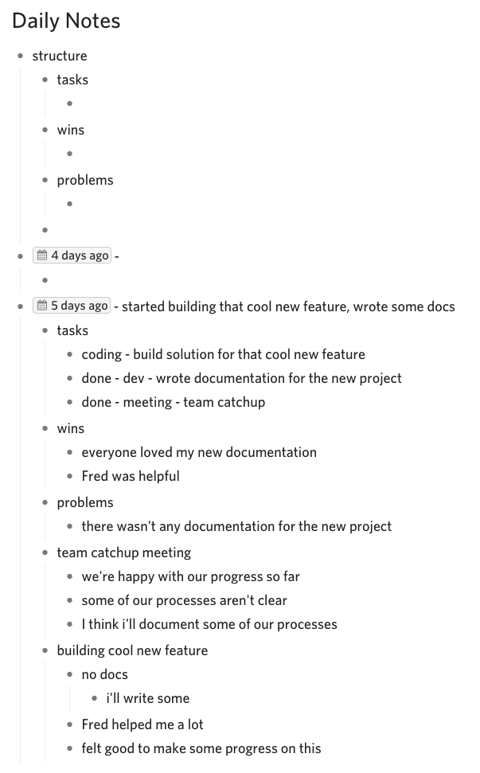
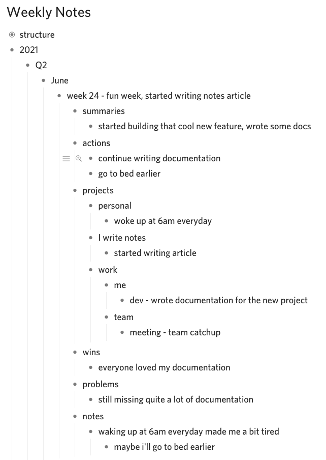
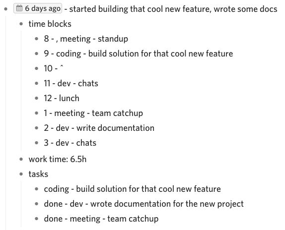

I write lots of notes. I wrote about 15,000 bullet points and 100,000 words in 2020 and I'm up to about 10,000 bullet points and 60,000 words so far this year. I've been writing them for years. I started in school and continued at uni and then decided to keep writing notes at my first job. I handwrote them in [Spirax A4 120 page notebooks](https://www.officeworks.com.au/shop/officeworks/p/spirax-a4-no-810-recycled-notebook-120-page-es56800) using [blue BIC finepoint pens](https://www.officeworks.com.au/shop/officeworks/p/bic-cristal-fine-point-ballpoint-pens-blue-12-pack-bi1411be), non-perforated because perforated pages fall out and 120 because it's big enough without being too big. I went through about 4 notebooks a year until one day my salad dressing container leaked in my bag and destroyed my notebook so I cracked the shits and went digital.

## Dynalist

I use a tool called [Dynalist](https://dynalist.io/) because:

- It's free. You can also pay to get features like uploading images.
- It's in the cloud. My notes are backed up and available on my phone.
- It's focussed on bullet points, instead of documents and rich text. I love bullet points.

It's pretty similar to [Workflowy](https://workflowy.com/) if you've heard of that before.

Digital notes definitely have their advantages. They're not vulnerable to salad dressing and you can search through them to find things you wrote ages ago. Maybe you worked on something or made a decision or fixed a problem or maybe you just learnt something cool, it's all just a search away. That's handy because I found it a little bit easier remember handwritten notes but the search more than makes up for that.

The biggest drawback to digital notes is not being able to draw on them and I'm still working on this area. At the moment I'm using [Mermaid](https://mermaid-js.github.io/) and their [Live Editor](https://mermaid-js.github.io/mermaid-live-editor/) and [Miro](https://miro.com/) then I copy the link into my notes. [FigJam](https://www.figma.com/figjam/) also looks cool. Digital diagrams are great because they're more presentable and you can collaborate on them with your team if you need to. I think that outweighs the initial friction when using them. I still draw rough ideas on paper sometimes but I'll usually remake it in one of those tools afterwards.

## Daily Notes

I have a document in Dynalist called Daily Notes where each day has a structure like this:

- tasks
- wins
- problems
- (general notes)

For example:

I do this each day:

1. Create a new bullet point underneath structure. Minimise the structure bullet point before hitting enter.
2. Enter the current date with the Dynalist date insert (!), followed by a hyphen.
3. Copy and paste the structure into the current date.
4. Write down my tasks for the day, including meetings.
5. Start my day.
6. Write notes, add any tasks that popup and mark them as done when they're completed.
7. Add a short summary for the day next to the date, after the hyphen.

I like to roughly categorise my tasks. I'm a developer so my categories are:

- dev - General dev tasks including chats, emails, reviewing pull requests, designing solutions, writing documentation etc.
- coding - Actually developing code.
- meeting - Sync time with people.

I generally write down anything noteworthy and that usually turns out to be quite a lot. If in doubt, write it down but find a level that works for you. I'm always overwriting some things and underwriting others but that's all part of the process. I've also found myself being a bit too critical and trigger happy with wins and problems so I now prefer to put more in my general notes and leave the wins and problems for big stuff. That might be more of a me problem though.

## Weekly, Monthly and Quarterly Notes

Daily notes can become quite noisy so I like to summarise weeks, months and quarters to highlight bigger things. 

I have a Weekly Notes, Monthly Notes and Quarterly Notes document with the following structure:

- summaries
- actions
- projects
  - personal
  - (other projects)
  - work
    - me
    - team
- wins
- problems
- notes

For example:

The structure is pretty similar to Daily Notes with a few additions:

- Summaries - all the daily summaries for the week in one place.
- Actions - action points for the next week.
- Projects - tasks organised by project.

I write my Weekly Notes on a Monday morning and it usually takes 45 mins. I've got it scheduled in my calendar and try to avoid chats and emails until they're done. I write my notes from memory first then go through my Daily Notes to fill in the blanks afterwards. I do something similar for my Monthly and Quarterly Notes where Weekly Notes rollup into Monthly Notes and Monthly Notes rollup into Quarterly Notes. 

This makes performance reviews really easy but you can also reflect at a personal level as well. You might discover some recurring problems and set some actions for them or reflect on your achievements. I've also fallen into the trap of being a bit too critical and ambitious but, again, that might be more of a me problem.

## Projects

Sometimes a task lasts more than a few days and that's when it becomes a project. I like to keep things simple and write notes in my Daily Notes then move them out into their own document when I need to, usually on the 3rd day of working on it. I organise my project documents by month using Dynalist's folders.

## Time blocks

I've got a section in my Daily Notes called Time Blocks to get a rough idea of where I'm spending my time.

It looks like this:

- time blocks
  - 8 - , meeting - standup
  - 9 -
  - 10 -
  - 11 -
  - 12 -
  - 1 -
  - 2 -
  - 3 -
- work time:

When it's filled out it might look something like this:

Basically, I record what I did in 30 minute blocks. If I did two things in an hour then I separate them with a comma and if I did the same task in the next hour then I use a tilde. The "meeting - standup" is part of my structure because I have it everyday and I don't want to rewrite it everyday. At the end of the day I add up the time and record it. I don't include the time blocks in my Weekly Notes but I've experimented with summing up the hours.

## Work Tasks and Ideas

Whenever I have a random idea or task I don't have to do right away I'll write it in my Work Tasks and Ideas document. That way I've got a list of cool things to pickup if I get some spare time.

## Summary

I write notes and that's kind of how I do it. Actually, these are just some of my favourite strategies so far because how I write them changes quite regularly. Experimenting is big part of writing notes so play around and experiment for yourself to find something that works for you.
