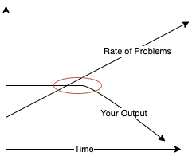

[ work in progress ]

I've been Practicing Mindfulness for about a year now and during that time it's since become an important part of my life. I originally planned to practice twice a day for a week in 2020 but it's now 2021 and I've practiced for hundreds of hours so I thought I would share some of my thoughts and experiences.

For me, Mindfulness is about **exploring with patience and acceptance** and I practice it with three activities:

- Meditation.
- Yoga.
- Walking.

It's simple but simple doesn't mean easy. It's been a weird, interesting and unique experience and has been really positive for me. I also believe Mindfulness is very personal so I'll explain how to practice first then talk more about my experience later.

## First Practice

Allocate an hour but it will probably take less than that.

- Meditation
  - Lie on your back with your eyes closed.
  - Set a timer for 10 minutes.
  - Stay lying down for slightly longer than you feel comfortable with. Aim for about 5 mins.
- Yoga
  - [Half Sun Salute](https://www.youtube.com/watch?v=gFkC5HLpfFY). Do about 3 and aim for a gentle stretch.
  - [Child's pose into Cobra](https://www.youtube.com/watch?v=HerlEPvo5es). Do about 3 and aim for a gentle stretch.
- Walking
  - Preferably around nature.
  - Around 1-2km or around 20-30 minutes.
  - Walk slowly.

The instructions are simple and ambiguous but I think that's a good way to start. Practicing is far more important than how you practice. There's no right or wrong way to do it.

I strongly recommend trying this first practice before reading further.

.

.

.

.

.

.

.

## Second Practice

This second practice is similar to the first with a little more direction.

Allocate an hour but it will probably take less than that.

- Meditation
  - Lie on the ground with your eyes closed.
  - Let your body settle for about a minute or so.
  - Gently bring attention to your breath. You might notice your diaphragm expanding and contracting or the sensation of breathing in your mouth. Do you notice your breath anywhere else in your body?
  - If you don't notice much, that's perfectly fine and is part of practice. Practice patience and acceptance with whatever you're feeling or not feeling. Continue to breathe.
  - If you find yourself thinking about something else, that's fine too and, again, is part of practice. When you're ready, gently bring attention back to your breath.
  - Bring attention to what the ground feels like underneath your body. You might notice different sensations in different parts of your body or more pressure in some parts, more than others. Gently explore the sensations in your body, they might change as you lie down longer. Allow your body to relax against the ground if it wants to.
  - Again, gently bring attention back to your breath at any time.
  - Practice for slightly longer than what feels comfortable.
- Yoga
  - Do the same exercises as the first practice.
  - Explore the sensations in your body as you stretch.
  - Go slow, especially for transitions between positions.
  - Gently bring attention back to your breath at any time.
- Walking
  - Explore your surroundings as you walk. You might notice the weather or the plants or animals around you.
  - Explore the sensations of walking in your body. You might notice sensations in some parts more than others and might change as you walk for longer,
  - Periodically bring attention back to your breath.

Throughout each exercise we're bringing attention to our senses and surroundings but doing so with patience and acceptance, slowly and gently. We also periodically bring attention back to our breath.

Again, there's no right or wrong way to do it, it's all about practice.

I strongly recommend trying this second practice before reading further.

.

.

.

.

.

.

.

## First Week

The first week is about practicing regularly and exploring further. Explore your senses, surroundings and yourself and do so with patience and acceptance.

- 2 practices per day, one in the morning then again in the evening or night.
- 5 days, Monday-Friday.

That's about 10 hours in total. I've found this is a good frequency to get started because each session can flow from the last.

If you found the previous two practices interesting, challenging or weird then I strongly recommend practicing for a week before reading further.

.

.

.

.

.

.

.

And that's it. That's more or less what I've been doing for a year or so.

## What is Mindfulness?

- ~~Exploring with patience and acceptance~~
- ~~It's more about how than what~~
- ~~It's more about the journey than the destination~~
- ~~You can't understand mindfulness by reading about it~~
- ~~Create a space to open up and connect~~
- Different activities invite you to connect with different things
- Mindfulness is also about reflection, self-discovery and contemplation
- Slowing down can let you tune in to feelings of stress
- Mindfulness helps you relax because you're practicing restful qualities
- Lean into discomfort

To me, Mindfulness is about exploring with patience and acceptance. We're exploring what's around us, our senses, our bodies and ourselves. It takes practice but we're not practicing to achieve something or feel a particular way, we're practicing for the sake of practice, practicing because we can. We're not actually doing much at all because we're tuning into what's happening instead of what we want to happen. It's more about being than doing, more about feeling than feeling good and more about a journey than a destination. It's simple but certainly not easy. You can bring Mindfulness into almost any activity because *how* you do things is more important than *what* you're doing. This might be difficult to understand partly because Mindfulness can't be fully understood by reading about it - you have to practice and experience it for yourself, on your own journey.

When we slow down, and practice patience and acceptance, we're opening ourselves up. We're creating a space and allowing our environment, sensations, feelings and thoughts to join us. It's like an invitation. We practice slowly and quietly so we can connect with slower and quieter things, things that are often too quiet to be noticed, hidden in plain sight. You can only see the stars at night, and only if you're outside looking up. Subtle things can become incredibly immersive if you give them the time and space and it can be incredibly humbling. Sometimes we might not find anything and other times we might find distress or discomfort and that's all part of the practice. It's an opportunity to practice patience and acceptance, not to relieve that tension but to explore it. [ beginner's mind ]

Different activities are going to invite us to explore different things. I practice mindfulness regularly with meditation, yoga and walking but you can bring mindfulness into almost any activity, like sitting on the couch, making a cup of tea, having a shower or even exercising. Meditation is most commonly associated with mindfulness and it can be powerful but it can also be uncomfortable and difficult. It's the quietest activity because you're not doing much at all and that's exactly the point. We're creating a space and giving us an opportunity to explore. You might notice sensations in your body, sounds from your environment or thoughts and feelings. We practice with patience and acceptance. We allow ourselves to feel whatever we feel, think whatever we think and notice whatever we notice. Just breathe. If you find meditation uncomfortable then practice sitting with that feeling and exploring it. Sometimes I feel a strong connection with my body and surroundings and other times I can't hear anything over my thoughts. It's all part of the journey. [ breathing is important ]

[ ^ can probably refine this a bit ]

Yoga is about exploring your body, how it moves and what that feels like. The intention isn't it improve our flexibility but to explore our range of motion, finding the edges of that range and noticing what that feels like. The edges will change over time with practice and exploring that can be really interesting because it builds a connection with your body. I've found it incredibly humbling, particularly with my hips. I found that they can move in ways I never thought possible and are deeply connected with our minds, lower back and posture. It's such a core part of my body I was completely unaware of.

[ ^ can probably refine this a bit ]

Walking is one of the more active mindfulness activities to practice. There's more things happening and I've found it can act as a nice bridge between quiet meditation and yoga and the rest of your day. I've walked hundreds of laps around my local park and noticed fungi growing and receding, different types of birds and their calls and different trees, how they sound as the wind rustles their leaves and how different lighting can change how they appear. It always surprises me to see how beautiful a massive gum tree can be in the morning light. I also like to watch the weather. Sometimes it's stormy and other times it's sunny, sometimes there's golden sunsets and other times it's dark. I practice watching it whatever it is. Stormy weather is often considered to be bad weather but I actually think it's rather beautiful when I watch it with patience and acceptance. It's similar to our minds. We can be in lots of different states and we're not in control of them. Some are often considered bad or negative but if we explore them with patience and acceptance we can find the beauty in them. We can learn to appreciate even the most distressing and uncomfortable feelings and maybe even be grateful for them.

[ Mindfulness is also about reflection, self-discovery and contemplation ]

Practicing Mindfulness also means creating a space for contemplation, reflection and self-discovery. There's very little stimulus to distract us and what we're left with is ourselves. What do you find? At first, you might find yourself thinking about things in your day to day but that might change if you keep practicing and keep creating a space to reflect. We often think we have a good idea of who we are but I certainly didn't until I started practicing. I don't even think I understood what that meant.

[ That's partly why breathing is so important because it's probably the smallest thing we can do to exist. ]

Practicing Mindfulness can give you a better understanding of yourself. When you're busy and stressed you're rushing to do lots of things. You don't have much time to think things through and act for the long term.

Your mindset has a big impact on how you interpret things happening around you. When you're relaxed, you can do almost anything and still feel satisfied. You can walk around the park or simply sit on the ground and breathe and still enjoy yourself. Inconveniences don't bother you as much. If you go for a walk and you get rained on it doesn't matter and it can actually be quite enjoyable. Contrast that to when you're stressed and even enjoyable situations can be really frustrating. If you drive 30 minutes to your favourite cafe and they're closed that can be really annoying especially if you planned to meet a friend there and don't have an alternative.

events + your mindset = perceived results 

The simple way to approach this equation is to improve your mindset which should improve your perceived results. I haven't found this to be the case. Unfortunately, we're just not that simple. It requires understanding, instead of fixing, and we're complicated people so that takes time, patience and acceptance.

When you slow down and do less, the events part of that equation approaches zero and what you're feeling is more of a result of your mindset. That's how Mindfulness can lead to a better understanding of yourself. It can also be really confronting. If you're in a tough place it can be really uncomfortable but it's really insightful to explore that discomfort. I realised that I really missed my grandparents who have passed, far more than I realised on a day to day basis.

[ this can be uncomfortable ]

These ideas come from Buddhism and I like how Yuval Noah Harari describes it in Sapiens.

> If, when the mind experiences something pleasant or unpleasant, it simply understand things as they are, then there is no suffering. 
>
> If you experience sadness without craving that the sadness go away, you continue to feel sadness but you do not suffer from it. There can actually be richness in the sadness. 
>
> If you experience joy without craving that the joy linger and intensify, you continue to feel joy without losing your peace of mind.

How do you do that? Practice.

[ your mental state extends when you practice mindfulness just like your flexibility extends when you practice yoga ]

Practicing restful qualities can shift you to a more restful state. It can be really uncomfortable to practice restful qualities when you're stressed but that discomfort is critical to the exercise. Don't shy away from it, explore it, sit with it and accept it. That builds understanding. Our day to day lives naturally lean towards the stress side because being resting isn't very profitable. The stress system is also addictive - it feels good to stress yourself and achieve something.

[ time is critical ]

[ open up ]

| Rest                                         | Stress                                 |
| -------------------------------------------- | -------------------------------------- |
| **Time isn't critical**                      | **Time is critical**                   |
| Slow                                         | Fast                                   |
| Patient                                      | Impatient                              |
| Mindful                                      | Compulsive                             |
| Content                                      | Antsy                                  |
| Accepting                                    | Critical                               |
| Uncertainty is good                          | Uncertainty is bad                     |
| Going with the flow                          | Measuring progress, making comparisons |
| **Open**                                     | **Closed**                             |
| Loose body                                   | Tight body                             |
| Slow, deep breathing                         | Fast, shallow breathing                |
| Exploring                                    | Goal-orientated                        |
| Thinking about the present                   | Thinking about the future              |
| Open to ideas                                | Focused                                |
| Empathetic                                   | Self-absorbed                          |
| Problems are opportunities for understanding | Problems need fixing                   |

[ not sure where this bit should go]

Being complacent can be scary because we often want to be proactive but it's important to recognise that complacency can also be productive. Not all feedback has to be actioned and not all problems have to be solved. This [article](https://blog.tjcx.me/p/the-perils-of-constant-feedback) talks about how feedback can result in local maximums in computer programs and I think it's the same for real life as well. Slow is smooth and smooth is fast.

I seem to be more concerned with my identity when I'm stressed. "What am **I** going to do?", "How am **I** going to work this out?", "What's wrong with **me**?", "**I** need to fix this.". I think that's because we are more self-centred when we're stressed, similar to a pain response. Part of opening up means letting go of that identity and just be. I can never seem to do this at the time but it's always clear to me in hindsight that we should question who the **I** in that sentence is. Is it your compulsive, stressed, anxious self acting in your short term interests or is it your resilient, open minded, patient self.

## My Experience

Earlier this year I was feeling pretty shit. I wasn't sleeping well, I was tired, and I felt like I was failing all the time. I hated how I felt so I was desperate to fix whatever was causing it. I thought if I could just solve some problems in my life then everything would be okay and I would feel okay again. So I swallowed down my failures and went at it.

And I failed again, and again, and again.

After a while, I started to feel a bit hopeless. If I couldn't fix things then I would feel awful forever and that was really frightening. The small progress I did make didn't make me feel any better so what was the point in trying anymore? To make things even worse, I was now exhausted. I couldn't fix things before, how could I possibly do it now in this state? I was fried.

I started Practicing Mindfulness a bit before this period because I remember practices where I felt peaceful and relaxed. That wasn't happening anymore. I sat in my local park feeling tired and frustrated, listening to my loud, rapid thoughts when just a few days before I was admiring the beauty of the trees in the early morning sun. I just couldn't see that anymore. I felt numb and my memories of the beautiful trees felt so far away, like it was months ago instead of days. It was like I was inside a hole - I was in the same spot, just underground and completely blind to my surroundings. I was acutely aware of the hole I was in, I just had no idea how to get out or even the energy to get out or figure it out. I felt like there was something seriously wrong with me and I was stuck.

After a few days, I started to feel a bit better, but it didn't last and I was in the same state again only a week later. It was painful to regress so far in such a short amount of time. It was yet another failure but it felt like the most crushing one yet.

Mindfulness was really frustrating at this point. I was practicing for 10 hours a week and had nothing to show for it. Wasn't it meant to help with stress management? In hindsight, I was still very much in the early days of my learning journey. It's not about achieving something or feeling a particular way, it's about exploring with patience and acceptance, no matter what you find. At some point it occurred to me that I needed to accept how I was feeling instead of fighting it and  embrace it instead of running from it. This was my turning point. Bashing my way through 'problems' was only digging myself into a deeper hole, patience and acceptance were the alternative. It's simple but simple doesn't mean easy.

Everything seemed ridiculously difficult when I was fried. Unlearning old habits and practicing new skills like patience and acceptance were even harder. I needed to practice when I still had some energy, in other words, I needed to focus on prevention rather than treatment. That meant riding out feeling terrible for a few days, then practicing more when I started to feel better again. It was really counterintuitive. Naturally, I didn't succeed the first time. I regressed again but I felt like I was beginning to understand for the first time.

I noticed that things could spiral out of control really quickly. One problem led to another, which led to another and they would all avalanche down on top of me. But I also noticed some warning signs when I practiced. If my thoughts were racing or I felt agitated or even antsy then that could mean I was feeling stressed, even more so if it happened in consecutive practices. It was really difficult because the warning signs were subtle. I think I was just so conditioned to them that I wasn't even aware of them. If I noticed warning signs then I tried to be even more patient with myself and allocate more time for practice and downtime.

I continued to have bad weeks every second week but each one gave me more insight and understanding which made me feel a bit more hopeful. I just needed more practice. I remember going out for dinner with friends one night and I came home feeling a bit down. It was weird because it was a nice evening so I started going down my habitual path of "Why am I feeling down? What's wrong with me?" and I started to feel a bit upset. All of a sudden, I had an epiphany. I just caught myself right before a downward spiral and knew exactly what I needed to do about it -  Practice patience and acceptance. It was a massive relief.

Finally, after a few months, I broke the cycle and felt good for two weeks in a row. I still have bad weeks occasionally and sometimes I don't handle them as well as I probably could but I'm okay with that. When they do happen, I practice giving myself the time and care I need to manage it.

## Burnout

[ maybe talk about contributing factors? Also why I found it hard to ask for help? ]

I've done a lot of reflection since my low point in 2020 and I'm pretty sure I was burnt out - my brain associated effort with failure. Recovery takes time where you'll cycle through symptoms like I did. It's commonly associated with long work hours, which I wasn't doing but I now realise it's more to do with stress and recovery. I won't go into too much detail about what burnout is here but [Emotional resilience and burnout in leadership](https://docs.google.com/document/d/18FfZ86PGA_uSFf425EzKXAmiFQLFBPqjqPN7iu1TZRw/edit?usp=sharing), from [resilient.wiki](https://resilient.wiki/), is a good place to start.

Stress has been a big part of my career, so much so that I wasn't even aware of it. I write my tasks in a list, complete them one by one and I push myself to get as many done as possible. Pushing myself means applying stress which helps block out distractions and helps you focus. I was pretty good at it after practicing every working day for years and it felt nice to be productive and be recognised for it. It was part of my identity.

Many people have no issues doing this. I didn't either until I found myself in a losing situation at work, one I couldn't succeed in. The smart thing to do is try a few times then accept the situation and move on but I just couldn't seem to do that. I kept pushing, kept getting burnt and kept failing. Even when I failed I would leave work and try to get my mind off it only to find myself thinking about it all over again later on. My problems followed me.

At some point it affected my sleep, which affected my judgement, which led to more failure, more stress, less sleep and the cycle continued. I didn't even know why I couldn't sleep at the time. I was so conditioned to stress that I wasn't even aware of how stressed I was. I remember thinking "All I need to do is get a good night's sleep" which, ironically, makes it really hard to sleep. To make things words, being tired meant running on autopilot and falling into old habits, the same ones that were keeping me awake at night.

It all sounds so silly to think back on now but at the time I couldn't see things any other way. I now know that's exactly how stress works - it makes you focus on something urgent. Unfortunately, that tunnel vision can also leave you blind to your surroundings and reality. It can make you feel like a failure when you're surrounded by success and make you feel isolated when you're surrounded by loved ones. It makes it hard to connect with anything or anyone. I never thought about killing myself but I think I have a better understanding of how someone might get to that point.

[ I felt like I was being run off a treadmill going too fast, I was desperately trying to keep up but I was failing an eventually I gave up because it felt like there was no point anymore]

[ maybe this should be problems vs capacity to fix problems ]

## Perspective

When I was burnt out, I had a bleak perspective. I was tired, stressed and everything felt ridiculously difficult and I felt like I had to urgently fix whatever was making me feel this way. Practicing Mindfulness helped me through that period but it didn't fix my problems, it opened me up to new perspectives. It taught me how to be more patient and accepting and how to explore my senses, surroundings and myself. Once I practiced enough, the things that were stressing me out didn't seem so important anymore.

Patience and acceptance directly oppose the effects of stress. You don't feel the need to fix things when you accept your current state and you don't feel urgency when you're patient. It sounds simple but it can be incredibly difficult. It takes time and practice. It makes sense when you think about all the time you've spent practicing being impatient and critical. You can't expect to undo years worth of habits in hours or even weeks. You can't boil the ocean but you can practice, breath by breath. It's okay if you're not happy, if you're not where you want to be. You don't have to fix it. There's nothing to fix, these feelings are part of life and are important to experience and understand. It's about the journey, not the destination. It's about being, not doing. I was pretty messed up and I needed to accept that and when I eventually did it was strangely comforting. From there you can begin to explore and build understanding.

You might find it difficult to commit to practice because it can seem pointless. Technology puts interesting things at your fingertips and it's so satisfying and habit-forming that you can easily spend every spare second you have consuming media. Sometimes you can't see the forest from the trees. Practice may seem pointless but that's almost the point - doing pointless things can open you up to a world of new perspectives and ideas. It's what's known as practicing a "beginner's mind" - practicing being a student instead of a teacher and it can be incredibly humbling. We practice for the sake of practice and that means ignoring distractions that can get in our way.

When you explore openly, you're building awareness and connections. When you lie down to meditate you're becoming aware of your headspace, when you stretch in yoga you become aware of your body and when you go for a walk around the park you become aware of your surroundings. You're practicing opening up instead of focusing on something stressful. Body awareness has been particularly interesting for me because I learned about the intimate connection between our minds and bodies. Our bodies change when we're stressed. Muscles tighten and digestion changes and I've read that we might even feel stress through these changes in our bodies, instead of the other way around. If that's the case then stretching might have a direct effect on our mood. Regardless of causality, building body awareness is an important part of Mindfulness. When I couldn't sleep, I was annoyed at my body because it wasn't doing what I wanted it to do. I now realise my body was annoyed at me because I wasn't giving it what it needed. We're a team.

Exploring your body can go really deep. A handful of times I've fallen into something I can only describe as some sort of a trance while meditating. It kind of feels like I'm asleep but I'm still awake and my body feels like it's fallen through the floor and I can feel all these little sensations in different parts of my body all simultaneously. It's not particularly enjoyable but it's so weird and interesting that I naturally want to stay. I practice my breathing and staying still. When I open my eyes it all goes away and I wonder where I've just been. It's like going on a strange journey without going anywhere and when it's over I just feel refreshed, like I've just woken up from a nap. This idea might be hard to understand if you haven't practiced much before but when you spend enough time opening up some strange things can find you.

One night, I walked around my park and started exploring my surroundings. I heard the sound of crickets to my left, the rustle of tree leaves above me and felt a warm breeze on my face. I felt lucky and grateful to be there experiencing it all. Then I realised there must be an infinite amount of detail around me that I'm completely unaware of all the time. Then I realised if I'm patient and explore openly then I might get to experience some of those details, or some of those details might reveal themselves to me. I felt humbled and content and somehow felt a strange sense of purpose and peace. We're always moving through time, even when we're still. It's moving around us, delivering sensations and experiences and connecting everyone and everything together. "Spending time" seems like such a silly phrase because it's not ours to spend. I think about my family and friends, and the trees and the birds in the park, and I wish them all the best with whatever they're doing, wherever they are. I'm not a spiritual person but I can't help but think there's something spiritual about wishing for the best from something external.

I often find myself thinking about my grandparents who have passed when I practice. Sometimes it can be quite emotional and I've shied away from those emotions in the past but now I try to embrace them with patience and acceptance. If it gets too much, I bring my attention back to my breath and continue exploring when I'm ready. Sometimes I've felt like they've been right there with me as I walk around the park. That might sound strange at first but it's not so hard to understand when you realise how much of an impact loved ones can have on you. They're a part of who you are and if you open yourself up then they might not feel so far away.

Practicing Mindfulness has been a uniquely interesting experience. It's certainly changed how I think about things and that's probably because I've explored and experienced things I never have before. I feel like I have a better understanding of myself, my body and what's around me and I feel more resilient. I used to strive for happiness and success but now I think they're rather fickle, short-lived and short-sighted. Now I strive to balance that with Mindfulness - exploring openly with patience and acceptance. This isn't a destination, it's just a rough description of where I'm at on my journey. I'll continue to wander, wonder and practice.

## Conclusion

[ maybe make this more conclusive? ]

[ I find mindfulness suits me well but that might be because my personality naturally tends to lean more towards stress ]

This is close to the first essay I've written since high school. I've always found longer forms of writing difficult and a personal topic like this was even more so. Mindfulness was the inspiration for this essay but it was also the method. It's taken hundreds of hours over many months and has been an exercise in accepting where my writing skills are at and practicing patience while I worked on them. It's tested me immensely but I'm glad I could find some words to somewhat reflect my experience, even if it's just a reminder for my future self.

## More Ideas

Mindfulness is a personal journey so it's important to explore what works for you. Here's some ideas to experiment with:

- Practicing while waiting for something or someone.
- Practice while eating or drinking. Nuts, tea or soda water are some ideas.
- Practice while someone is watching TV.
- Practice with some music playing.
- Practice after a workout or a run.
- Practicing when you feel tired, instead of having a nap.
- Practice sitting cross legged and watching nature. I like to watch birds, insects and trees.
- Practice while lying on your back looking at the sky.
- Practice stretching your groins, doing hip thrusts or the [90-90 stretch](https://youtu.be/8p6FtlqpAYg?t=184) for hip mobility.
- Practice different schedules. I personally like first thing in the morning and then straight after work but I've also enjoyed practicing at night, particularly walking around my park at night.
- Try out some local yoga classes.

## More Resources

- [Cam Watkins on Instagram](https://www.instagram.com/cammwat/?hl=en).
- [How to Do Nothing: Resisting the Attention Economy by Jenny Odell](https://blogs.lse.ac.uk/usappblog/2020/03/01/book-review-how-to-do-nothing-resisting-the-attention-economy-by-jenny-odell/). Haven't read it but it sounds interesting.
- [Feynman: I am burned out and I'll never accomplish anything (1985)](https://www.asc.ohio-state.edu/kilcup.1/262/feynman.html) and [comments](https://news.ycombinator.com/item?id=26931359).
- My Octopus Teacher on Netflix.
- Add more later.

## Timeline

3/6/21 - copy edit.

1/8/20 - started writing.
